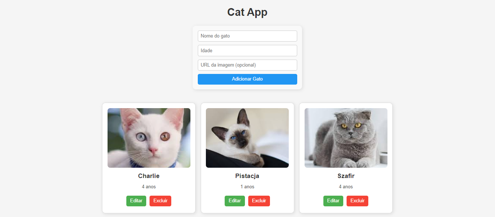
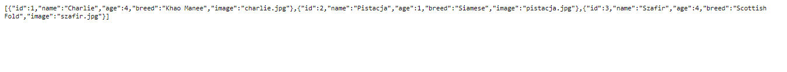

# 🐱 Cat CRUD API & React App

🛠 Tecnologias usadas: Node.js, Express.js, React.js, React Modal, React Toastify

📌 Objetivo: Criar um CRUD para gerenciar gatos, permitindo cadastrar, visualizar, editar e excluir 🐾.

##📌Capturas de Tela

Aqui estão algumas capturas de tela que mostram como a aplicação funciona:

## Tela Inicial

## Tela de Edição de Gato

## Servidor Backend para CRUD de Gatos (Node.js e Express)

*✔ API RESTful* para gerenciar gatos.
*✔ CRUD completo:* Adicionar, listar, editar e excluir gatos.
*✔ React Modal:* Formulário intuitivo para cadastro/edição.
*✔ Armazenamento* temporário em JSON (sem banco de dados).

###📌 2. Tecnologias Utilizadas

✅ Back-end:
	*•	Node.js*
	*•	Express.js*

✅ Front-end:
	*•	React.js*
	*•	React Modal*
	*•	Fetch*

###📌 3. Estrutura do Projeto

*📂 cat-api (Servidor Express - Back-end)*
*┣ 📂 data/ → Contém cats.json com os gatos armazenados.*
*┣ 📄 server.js → Código do servidor Express.*
*┣ 📄 package.json → Dependências do projeto.*

*📂 cat-app (Aplicação React - Front-end)*
*┣ 📂 src/components/ → Componentes React.*
*┃ ┣ 📄 CatList.js → Lista de gatos.*
*┃ ┣ 📄 CatForm.js → Formulário para adicionar/editar.*
*┃ ┣ 📄 CatCard.js → Componente individual de um gato.*
*┃ ┣ 📄 CatCard.css → Estilos do cartão.*
*┃ ┣ 📄 CatForm.css → Estilos do formulário.*
*┃ ┣ 📄 CatList.css → Estilos da lista.*
*┣ 📄 App.js → Estrutura principal do React.*
*┣ 📄 index.js → Ponto de entrada do React.*

#📌 4. Como Rodar o Projeto?

### 1️⃣ Clonar o repositório

*git clone https://github.com/seu-usuario/cat-crud.git*
*cd cat-crud*

### 2️⃣ Instalar as dependências

Back-end (Node.js / Express)

*cd cat-api*
*npm install*
*node server.js*

Front-end (React)

*cd ../cat-app*
*npm install*
*npm start*

Acesse em: *http://localhost:3000* 

### 📌 5. Endpoints da API

Método	Rota	Descrição
GET	/users	Retorna todos os gatos
POST	/users	Adiciona um novo gato
PUT	/users/:id	Atualiza um gato
DELETE	/users/:id	Remove um gato

### 📌 6. Aprendizados e Melhorias Futuras

 ✅ Aprendizados:
	•	Construi um CRUD completo usando React e Express.
	•	Aprendi a manipular JSON como banco de dados temporário.
	•	Usei modais e notificações para melhorar a UX.

📌 Melhorias futuras:
	•	Conectar com um banco de dados real (MongoDB ou PostgreSQL), substituindo o arquivo JSON.
	•	Criar autenticação (JWT) para garantir que apenas usuários autorizados possam editar ou excluir gatos.
	•	Melhorar o design com Styled Components ou TailwindCSS.
  •	Testes: Adicionar alguns testes unitários com Jest para o backend e frontend para melhor qualidade do código.
 
